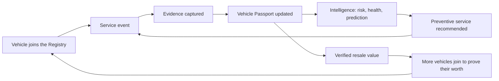
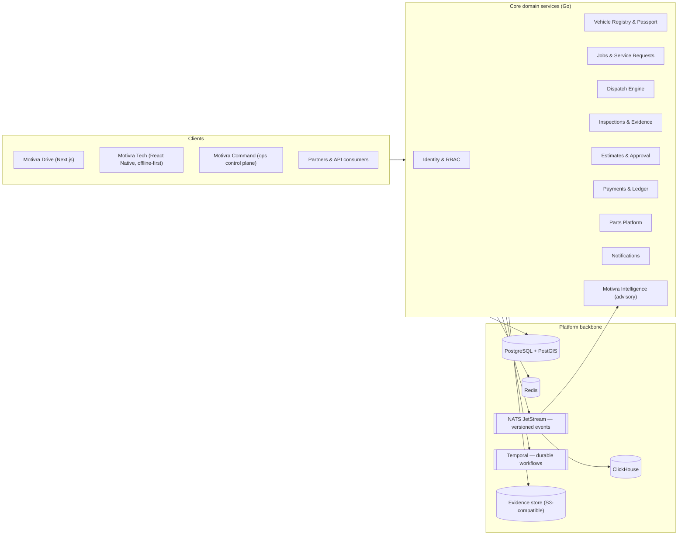

# MOTIVRA

**Vehicle intelligence & service infrastructure for Africa.**

*The garage comes to you. The vehicle never forgets.*

[For investors](#for-investors) · [For engineers](#for-engineers) · [Roadmap](#roadmap) · [Ideas board](docs/IDEAS.md)


> **One tap: "My car won't start."**
> A verified technician arrives with the right skills, equipment and parts. They inspect with photo evidence, diagnose, and quote transparently. You approve before a single bolt turns. Every completed repair is written permanently to the vehicle's **Vehicle Passport** — so the next owner, insurer or mechanic inherits a vehicle with a memory instead of a mystery.

---

## For investors

### Why this exists

Vehicle ownership across African markets runs on a broken service layer. There is no trusted way to answer three questions: *who can fix this car, what exactly is wrong with it, and what has been done to it before?* Mechanics are skilled but invisible — no verified history, no ratings that matter, no economics that let them invest in tools. Owners react to breakdowns instead of preventing them. Fleets bleed margin into unplanned downtime. Used-car buyers pay for vehicles whose odometers lie, because there is no tamper-evident service record anywhere in the market.

This is not a UX problem. It is a **missing infrastructure layer**: vehicle identity, verified service history, and a coordinated service network. Whoever builds that layer becomes the system of record for millions of vehicles — and the default rails on which insurers, dealers, fleets, parts suppliers and lenders operate.

### What Motivra is

Motivra is a **vehicle intelligence and service infrastructure platform**. The mobile mechanic is the entry point — the wedge that creates transactions and trust. Underneath it, one event-driven platform connects the entire vehicle lifecycle:

```text
DISCOVER → VERIFY → INSPECT → BUY → OWN → MAINTAIN → REPAIR → OPERATE → SELL → VERIFY AGAIN
```

Nine product surfaces run on the same infrastructure:

| Product | Serves | What it unlocks |
|---|---|---|
| **Motivra Drive** | Vehicle owners & buyers | Service requests, roadside assistance, vehicle passport, history, pre-purchase inspections |
| **Motivra Tech** | Technicians & inspectors | Jobs, offline-first inspections, diagnostics, estimates, earnings, AI copilot |
| **Motivra Inspect** | Professional inspectors | Dynamic inspection templates, evidence capture, verified reports |
| **Motivra Garage** | Partner garages | Appointments, capacity, inventory, invoices, warranties |
| **Motivra Fleet** | Fleet operators | Maintenance schedules, downtime analytics, predictive service, cost per vehicle |
| **Motivra Dealer** | Dealerships | Verified inventory, reconditioning workflows, buyer trust |
| **Motivra Command** | Internal operations | Live dispatch map, escalations, incidents, system health |
| **Motivra Intelligence** | The platform itself | Diagnostic assistance, predictive maintenance, pricing and demand intelligence |
| **Motivra Developer** | External partners | APIs, webhooks, sandbox, SDKs — Motivra as infrastructure |

### The moat: a vehicle data flywheel

Every job makes the next job better. That is the compounding loop no marketplace of unverified mechanics can copy:



The defensible assets stack in order: **vehicle identity → history → evidence → provenance → the vehicle graph → intelligence → a service network that trusts its own data → an API ecosystem the industry builds on.** A competitor can clone an app in a quarter. Nobody can clone ten years of verified vehicle history — and the first mover writes it.

### How Motivra makes money

Seven revenue streams, sequenced so monetization never outruns value:

| Stream | Mechanism | Phase |
|---|---|---|
| Service fee | Platform fee on each job (callout + labour + parts); technician sees gross → fee → net, always | MVP |
| Inspections & reports | Paid pre-purchase inspections and verified vehicle reports | Wave 3 |
| Parts margin | Negotiated procurement spread on facilitated parts, transparent to the customer | Wave 6 |
| Garage network | Lead and transaction fees plus SaaS subscriptions for partner garages | Wave 6 |
| Fleet SaaS | Recurring per-vehicle plans (Starter / Growth / Enterprise) — the recurring-revenue engine | Wave 7 |
| Enterprise APIs | Metered access for insurers, dealers, lenders, marketplaces | Wave 7+ |
| Customer subscription | Discounted callouts, priority dispatch, annual inspections — only once recurring value is proven | Later |

The operating discipline is explicit: **optimize contribution margin + retention + customer satisfaction — never GMV alone.** The platform carries a unit-economics engine (revenue per job, parts margin, technician utilization, CAC/LTV, refund and warranty cost) and an investor metrics layer (take rate, gross margin, MRR, retention cohorts, escalation rates) designed in from the start.

### Why Africa, why now

- **Mobile-first by necessity, not trend.** Customers arrive on phones; technicians work in areas with intermittent connectivity. The platform is designed offline-first end to end — including a technician app that never loses job data to a network failure.
- **Payment rails already exist.** M-Pesa-first payments, with card, bank and wallet behind a provider abstraction — money moves in integer minor units through an authoritative ledger.
- **The channels people actually use.** SMS and WhatsApp are first-class notification and interaction channels, not afterthoughts.
- **A mechanic supply chain waiting to be organized.** Skilled technicians lack demand aggregation, trust signals and financing. Motivra organizes supply instead of fighting it — including explainable quality scoring that rewards good work.
- **Starting in Nairobi, designed for expansion.** Multi-tenancy and country-connector architecture mean entering Mombasa, Kisumu, Nakuru — and later markets — is configuration, not a rewrite.

### The first loop we ship

The MVP is not a feature list — it is one loop, executed exceptionally well:

```text
Customer registers → registers vehicle → Vehicle Passport appears
Customer: "car won't start" → AI triages (advisory, with confidence & source)
Dispatch scores technicians (fit, distance, equipment, performance — explainable)
Technician accepts → arrives → inspects with evidence → diagnoses
Estimate → customer approves → repair → payment (M-Pesa)
Warranty + service report + Vehicle Passport update + maintenance recommendation
```

**Definition of done for the first milestone:** a real customer requests help, a real technician completes the job, the customer approves and pays, and Motivra records the entire service lifecycle reliably. Everything else is built on top of that loop.

### Honest status

This repository was bootstrapped in **September 2026**. It is at the very beginning: architecture and engineering governance land first, then implementation waves (see [Roadmap](#roadmap)). We hold ourselves to a no-vanity-metrics policy — when numbers appear in this README, they will be real customers, real jobs, real revenue, real retention. Until then, judge us on the architecture, the process discipline, and the quality of what we ship. We expect to be judged that way after launch, too.

---

## For engineers

This repository is built as a coordinated multi-agent engineering organization — principal engineers, SREs, security, QA, data and AI specialists working in bounded contexts through issues, contracts and reviewed PRs. If you are evaluating this codebase as a signal of engineering culture, the culture is the point: [the rules we build by](#engineering-principles) are enforced in templates, CI and review — not aspirational wall art.

### The stack — and why each piece earns its place

| Layer | Choice | Why it earns its place |
|---|---|---|
| Backend | **Go** (chi, connect-go/gRPC, sqlc, pgx) | Predictable performance, strict typing, single binaries, no framework magic |
| API contracts | **OpenAPI + Protobuf** | Contract-first: producers own schemas, consumers integrate against contracts, breaking changes are versioned |
| Data | **PostgreSQL + PostGIS** | Authoritative source of truth; geospatial dispatch built into the datastore. JSONB only when justified |
| Cache | **Redis** | Caching, rate limiting, ephemeral coordination — never a source of truth for money or history |
| Events | **NATS JetStream** | Versioned, idempotently consumable domain events (`vehicle.created.v1`, `payment.completed.v1`, …) |
| Workflows | **Temporal** | Durable dispatch, inspection, payment, warranty and reminder flows — never ad-hoc goroutines or cron |
| Object storage | **S3-compatible** (R2 / MinIO locally) | Inspection media, evidence, reports, signatures, invoices |
| Search | **OpenSearch** | Only when search complexity justifies it; PostgreSQL stays authoritative |
| Analytics | **ClickHouse** | High-volume analytics kept off the transactional database |
| Web | **Next.js, TypeScript, Tailwind CSS, shadcn/ui, TanStack Query, Zod** | One reusable Motivra design system; Playwright + Vitest gates |
| Mobile | **React Native + SQLite** | Offline-first field tool: local state, outbox, sync queue, conflict resolution, resumable uploads |
| Infrastructure | **Docker, Kubernetes, Helm, OpenTofu, Argo CD, GitHub Actions** | GitOps, rolling and canary deploys, automated rollback |
| Observability | **OpenTelemetry, Prometheus, Grafana, Loki, Tempo** | Every service exposes health, readiness, metrics, traces and structured logs — SLOs from day one |

### System architecture



**Bounded contexts own their data.** Identity owns users, roles and sessions; Vehicles owns vehicles, passports and history; Jobs owns requests and the job state machine (`CREATED → TRIAGING → … → COMPLETED`, plus `CANCELLED / FAILED / ESCALATED`); Payments owns the ledger. Cross-domain interaction happens only through APIs, commands and versioned events — never by touching another domain's tables. Migration chains are partitioned per domain; destructive changes follow **expand → migrate → contract**. Dispatch decisions and technician quality scores are **explainable by design** — no opaque punitive algorithms.

### Engineering principles

1. **Contract-first.** Producers own schemas; consumers integrate against contracts; breaking changes require versioning and a compatibility window.
2. **One owner per bounded context** — including its tables, events and workflows. Cross-boundary changes go through dependency requests, not drive-by edits.
3. **History is append-only.** Vehicle history and evidence are never silently mutated; corrections are new records.
4. **Money in integer minor units.** Every financial operation carries an idempotency key, transaction ID, audit record and provider reference. The ledger is authoritative; **AI can never modify it**.
5. **Never trust the client** — prices, ownership, permissions, payment state, inspection state, vehicle history, technician status are all server-authoritative.
6. **AI is advisory.** Every AI output carries prediction, confidence, source and verification state. "Possible causes are…" — never "replace this immediately." The human technician owns the repair decision.
7. **Offline-first for the field.** The technician app survives network failure: outbox, sync queue, idempotency, conflict detection, resumable uploads.
8. **External failure is a designed case.** Payment provider down → retry, alternate provider, reconcile. Maps down → cached location, approximate routing. No external service becomes a silent single point of failure.
9. **Expand → migrate → contract.** Migrations are backward-compatible, tested, documented and reversible; nothing destructive ships in a normal deploy.
10. **No incomplete features.** No TODO implementations, fake APIs or mocked production flows merge — a feature is complete or it does not ship.
11. **Every PR answers for itself**: problem, solution, architecture and database impact, API changes, events, security implications, testing, observability, rollback. No vague PRs.
12. **Explainability over opacity** — dispatch scoring, technician quality and AI assistance must be observable and understandable by the people they affect.

### How work flows

```text
Issue (typed: feature / bug / architecture / infra / security / docs / tech-debt / spike)
  → Branch (agent/<domain>/<topic> — one owner per branch)
  → Implementation + tests (unit, integration, contract, E2E)
  → PR (template-enforced: impact, security, rollback, observability)
  → CI quality gates (build, lint, tests, security scan, migration validation, coverage)
  → Review → Merge → Issue auto-closes
```

Between waves, the project runs **integration windows**: feature development pauses for end-to-end, migration, security and load validation before the next wave unlocks. Critical flows — the customer-to-payment happy path — must hold full E2E coverage.

### What you could own

| Domain | Ownership zone | Example surface |
|---|---|---|
| Platform foundation | `/backend/platform` | Config, middleware, DB layer, OTel, graceful shutdown |
| Identity & security | `/backend/identity` | AuthN/AuthZ, RBAC, sessions, tenant isolation, audit |
| Vehicle identity | `/backend/vehicles` | Registry, VIN resolution, passport, append-only history |
| Jobs & dispatch | `/backend/jobs`, `/backend/dispatch` | Job state machine, explainable dispatch scoring |
| Inspections & evidence | `/backend/inspections` | Templates, media, findings, verified reports |
| Money | `/backend/payments` | Provider abstraction, M-Pesa, ledger, reconciliation |
| Network | `/backend/parts`, `/backend/garages` | Catalog, inventory, reservations, garage capacity |
| Clients | `/apps/*` | Drive (Next.js), Tech (React Native), Command (ops) |
| Intelligence | `/backend/ai` | Triage, copilot, predictions — advisory outputs only |
| Platform ops | `/infrastructure`, `/observability` | Helm, Argo CD, SLOs, dashboards, runbooks |

See [CONTRIBUTING.md](CONTRIBUTING.md), the [architecture overview](docs/ARCHITECTURE.md) and the [glossary](docs/GLOSSARY.md) — one shared vocabulary for every team.

### Target repository layout

```text
/apps/
  customer/          # Motivra Drive (Next.js)
  technician/        # Motivra Tech (React Native, offline-first)
  admin/             # Motivra Command (ops control plane)
  fleet/             # Motivra Fleet portal
/backend/
  platform/ identity/ vehicles/ jobs/ dispatch/
  inspections/ estimates/ payments/ parts/ garages/
  notifications/ ai/ analytics/
  migrations/<domain>/
/contracts/          # OpenAPI, protobuf, event schemas
/infrastructure/     # Docker, Helm, OpenTofu, Argo CD
/observability/      # Dashboards, alerts, SLOs, runbooks
/docs/               # Architecture, ADRs, roadmap, glossary, engineering
```

## Roadmap

Execution proceeds in waves with integration windows between them — no continuous merging without synchronization:

| Wave | Focus | Key outcomes | Status |
|---|---|---|---|
| 0 | Discovery & architecture | ADRs, domain map, contracts, design system, roadmap | **In progress** |
| 1 | Foundation | Platform primitives, identity & RBAC, observability backbone | Planned |
| 2 | Vehicle foundation | Registry, passport, append-only history | Planned |
| 3 | Inspection | Templates, evidence capture, verified reports | Planned |
| 4 | Mobile garage | Jobs, dispatch engine, technician app, estimates | Planned |
| 5 | Money | Payments (M-Pesa first), ledger, warranties | Planned |
| 6 | Network | Parts, garages, towing & roadside | Planned |
| 7 | B2B | Fleet, dealer, developer platform & APIs | Planned |
| 8 | Intelligence | Predictive maintenance, pricing, demand forecasting | Planned |
| 9 | Hardening | Security, QA, chaos testing, performance | Planned |
| 10 | Production | GitOps, canary releases, SLOs, incident runbooks | Planned |

## Contributing

The build is issue-driven: every meaningful feature starts as a GitHub issue, every implementation issue produces a PR, every PR references its issue. Start with [`good first issue`](../../issues?q=is%3Aissue+is%3Aopen+label%3A%22good+first+issue%22) or the [ideas board](docs/IDEAS.md). PR and issue templates enforce the standards above — they are the fastest way to a review.

## License

Licensing (open-source vs open-core vs proprietary) is an open decision tracked in the issues — it lands before the first external contribution merges.
